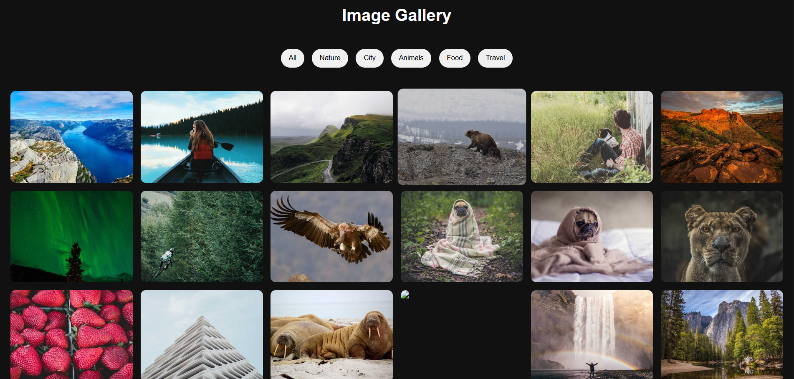
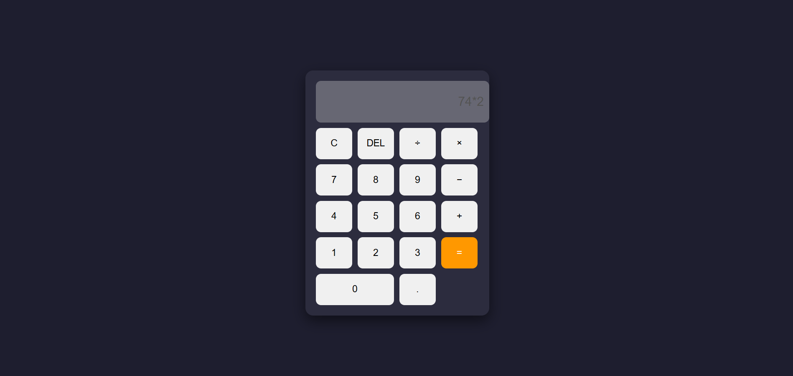
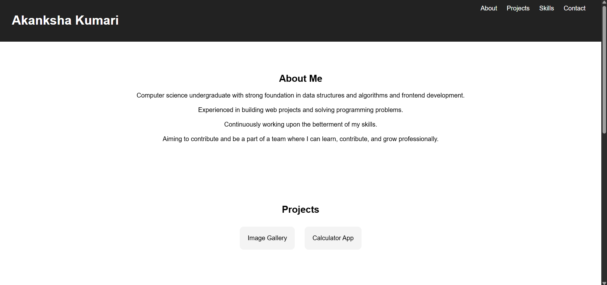
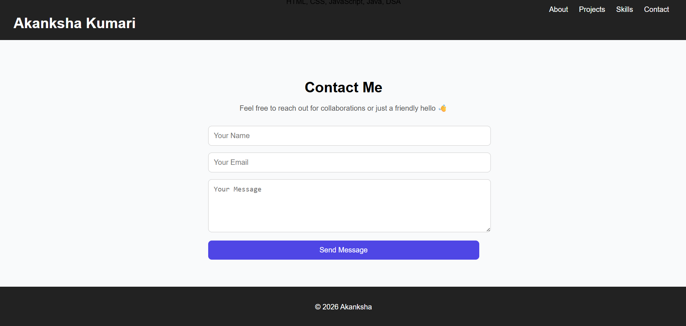

# 💻 CodeAlpha Internship Tasks

## 📌 Overview

This repository contains the tasks I completed during my **CodeAlpha Internship**,
focusing on building practical skills in **frontend web development** through real-world projects.

---

## 🚀 Tech Stack

* HTML5
* CSS3
* JavaScript

---

## 📂 Projects

### 🔹 1. Image Gallery

**Description:**
An interactive image gallery with filtering and image preview functionality.

**Features:**

* Category-based filtering
* Lightbox image preview
* Smooth UI interactions

**Learning Outcomes:**

* DOM manipulation
* Event handling in JavaScript
* UI design improvements

---

### 🔹 2. Calculator

**Description:**
A simple and responsive calculator for basic arithmetic operations.

**Features:**

* Addition, subtraction, multiplication, division
* Clean and responsive UI
* Real-time input handling

**Learning Outcomes:**

* JavaScript logic building
* Handling user input
* Debugging calculations

---

### 🔹 3. Portfolio Website

**Description:**
A personal portfolio website to showcase my skills and projects.

**Features:**

* Responsive design
* Projects showcase
* Contact section

**Learning Outcomes:**

* Structuring web pages
* Styling with CSS
* Improving UI/UX

---

## ▶️ How to Run

1. Clone the repository:
   git clone https://github.com/Akankshakumari15/CodeAlpha_Tasks.git
   
2. Open the project folder
  
3. Run `index.html` in your browser

---

## 📸 Screenshots

### Image Gallery

### Calculator

### Portfolio

---

## 🎯 Key Takeaways

* Strengthened frontend development skills
* Built interactive web applications
* Improved problem-solving and debugging
* Learned Git & GitHub workflow

---

## 📬 Contact

* **Name:** Akanksha Kumari
* **GitHub:** https://github.com/Akankshakumari15

---
